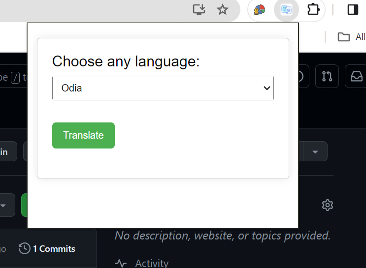
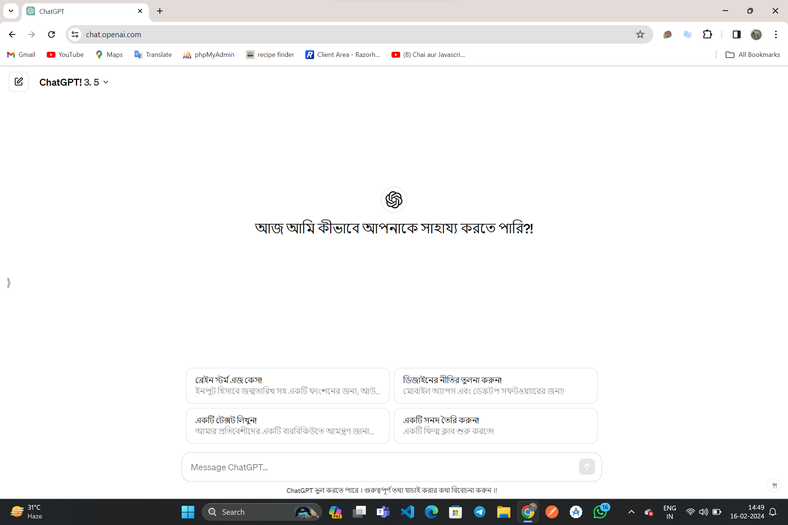
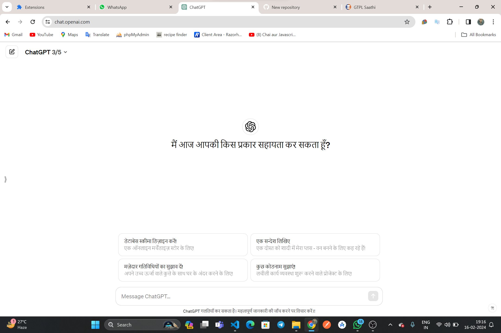

# WebPage Translator Chrome Extension

## Overview

The WebPage Translator Chrome Extension is a handy tool that allows users to translate the content of any web page from one language to another. Whether you want to read articles, blogs, or any other text in a language different from the original, this extension makes it easy to do so. Currently, it supports translation from English to Odia, Telugu, Hindi, Marathi, Bengali, and more.

## Features

- **Language Support**: Translate web page content from English to various languages, including Odia, Telugu, Hindi, Marathi, Bengali, and more.

- **User-Friendly Interface**: The extension provides a simple and intuitive user interface, making it easy for users to translate content with just a few clicks.

- **On-the-Fly Translation**: Translate content on the fly without the need to navigate away from the current web page.

## Installation

1. Download the extension files to your computer.

2. Open Google Chrome and navigate to `chrome://extensions/`.

3. Enable "Developer mode" in the top right corner.

4. Click on "Load unpacked" and select the folder where you downloaded the extension files.

5. The extension icon should appear in your browser toolbar.

## Usage

1. Navigate to the web page you want to translate.

2. Click on the WebPage Translator icon in the toolbar.

3. Select the target language from the dropdown menu.

4. The web page content will be translated instantly.

## Screenshots
### extension UI

### Results

## Support and Feedback

If you encounter any issues or have suggestions for improvement, please feel free to [create an issue](https://github.com/yourusername/webpage-translator-extension/issues) on our GitHub repository. We appreciate your feedback!

## Contributing

We welcome contributions from the community. If you would like to contribute to the development of this extension, please fork the repository, make your changes, and submit a pull request.

